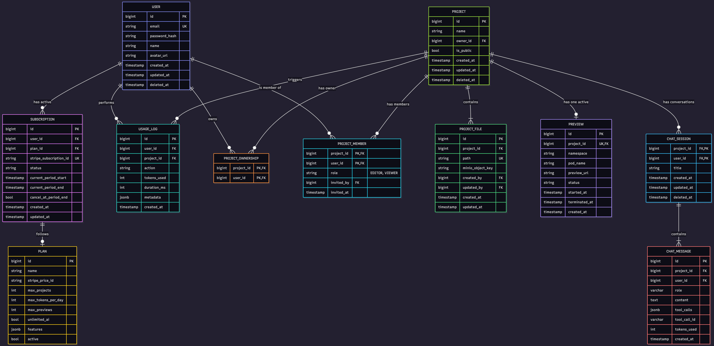

# Dev Engine AI

A full-stack project which builds other application with the help of AI-powered code generation, live previews, file management, and billing.

---

## 🗂️ Entity Relationship (ER) Diagram

## 🚀 Core APIs

### 🔐 Auth

| Action        | Method | Endpoint              |
|--------------|--------|-----------------------|
| Login        | POST   | `/api/auth/login`     |
| Sign Up      | POST   | `/api/auth/signup`    |
| Get Profile  | GET    | `/api/auth/me`        |

---

### 📁 Project

| Action                        | Method | Endpoint               |
|------------------------------|--------|------------------------|
| Create / Read / Update / Delete Project | CRUD   | `/api/projects/{id}` |
| Get All Projects             | GET    | `/api/projects`       |

---

### 📂 Files

| Action                                  | Method | Endpoint                                   |
|----------------------------------------|--------|--------------------------------------------|
| Get file tree + metadata               | GET    | `/api/projects/{id}/files`                 |
| Download single file (path encoded)    | GET    | `/api/projects/{id}/files/**`              |
| Download all files as ZIP              | GET    | `/api/projects/{id}/download-zip`          |

---

## ➕ Additional APIs

### 👥 Sharing & Permissions

| Action              | Method | Endpoint                                  |
|---------------------|--------|-------------------------------------------|
| Get all members     | GET    | `/api/projects/{id}/members`              |
| Invite by email     | POST   | `/api/projects/{id}/members`              |
| Change member role  | PATCH  | `/api/projects/{id}/members/{userId}`     |
| Remove member       | DELETE | `/api/projects/{id}/members/{userId}`     |

---

### 💳 Subscription & Billing

| Action                                   | Method | Endpoint                 |
|------------------------------------------|--------|--------------------------|
| List available plans (FREE, PRO)          | GET    | `/api/plans`             |
| Current plan + limits + billing date     | GET    | `/api/me/subscription`   |

---

### 💰 Stripe

| Action                               | Method | Endpoint                 |
|-------------------------------------|--------|--------------------------|
| Create Checkout Session → Redirect  | POST   | `/api/stripe/checkout`   |
| Open Customer Portal                | POST   | `/api/stripe/portal`     |

---

### 📊 Usage & Quotas

| Action                            | Method | Endpoint              |
|----------------------------------|--------|-----------------------|
| Tokens used / projects / previews| GET    | `/api/usage/today`    |
| Current plan limits              | GET    | `/api/usage/limits`   |

---

### 🤖 Chat & AI Generation

| Action                    | Method     | Endpoint                                             |
|---------------------------|------------|------------------------------------------------------|
| List chat sessions        | GET        | `/api/projects/{id}/chat-sessions`                   |
| Create chat session       | POST       | `/api/projects/{id}/chat-sessions`                   |
| Load full chat history    | GET        | `/api/chat/sessions/{sessionId}/messages`            |
| Chat stream               | SSE, POST  | `/api/chat/stream`                                   |

---

### ▶️ Preview & Runner

| Action                                 | Method | Endpoint                                   |
|----------------------------------------|--------|--------------------------------------------|
| Start live preview                     | POST   | `/api/projects/{id}/preview`               |
| Poll preview status                    | GET    | `/api/previews/{previewId}/status`         |
| Stream logs (npm install, Vite HMR)    | SSE    | `/api/previews/{previewId}/logs`           |
| Stop & delete preview                  | DELETE | `/api/previews/{previewId}`                |

---

## ✨ Features

### Core Features
- Project creation & management
- AI-powered code generation
- Live preview & execution
- File tree & ZIP download
- Chat-based development
- Retry on AI failure

### Auth
- Login
- Signup
- Get user profile

### Payments
- Stripe integration
- FREE & PRO plans
- Token & preview quotas

### System
- Rate limiting (Redis)
- Zipkin tracing
- Multi-user project collaboration